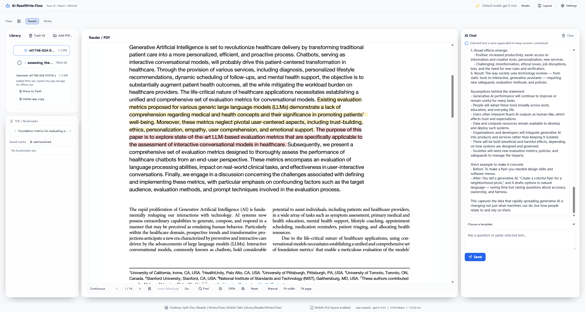
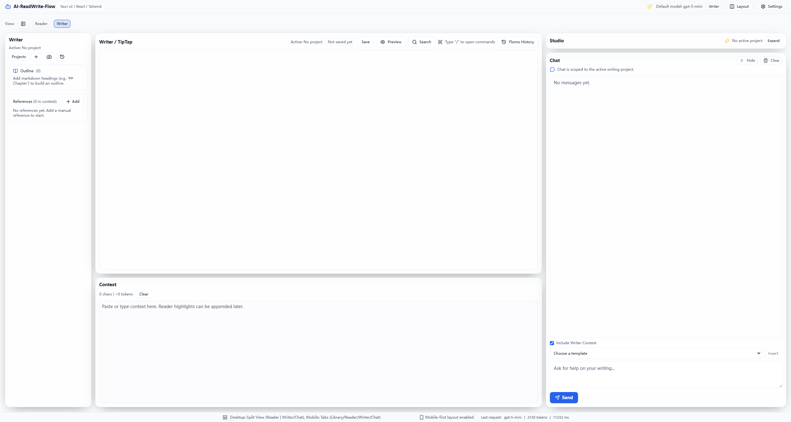
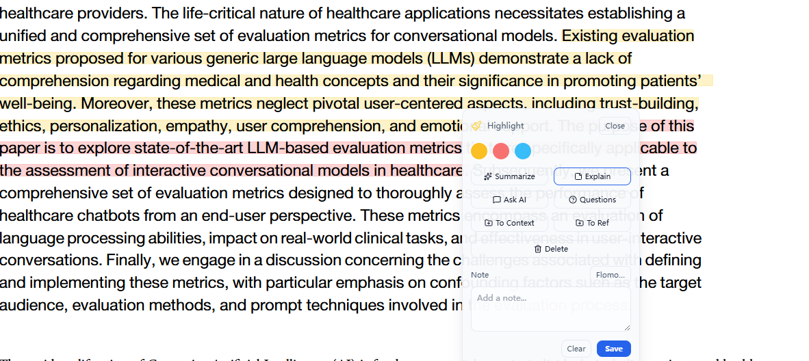

# AI ReadWrite Flow

Local-first workspace for reading PDFs and turning highlights into writing with AI. Built with Tauri, React, and Vite.

100% built with AI assistance (Codex + GPT-5.1).

## Features
- PDF reader with highlights, notes, bookmarks, and last-read restore.
- Floating selection actions: summarize, explain, ask AI, and questions.
- Writer workspace with projects, context, references, and AI-assisted actions.
- Local persistence (SQLite/store) and offline-friendly drafts.
- Theme presets and desktop/phone layouts.

## Screenshots




Screenshots live in `docs/screenshots/`. Replace the files above with your own.

## Requirements
- Node.js 20+
- Rust toolchain (stable, via rustup)
- Tauri CLI (`cargo install tauri-cli` or use `npm run tauri:dev`)

## Install
```bash
cd ai-readwrite-flow
npm install
```

## Run (Dev)
```bash
npm run dev
```

Run the desktop app:
```bash
npm run tauri:dev
```

## Build
```bash
npm run build
```

Build desktop installers:
```bash
npm run tauri:build
```

## Configuration
Copy the example env file and fill in your values:
```bash
cd ai-readwrite-flow
copy .env.example .env
```

Notes:
- `OPENAI_API_KEY` is required for AI features.
- `VITE_` variables are embedded in client bundles; avoid putting secrets there for web builds.
- Default API base is an example; configure your own endpoint.

## Privacy
Data is stored locally (SQLite, localStorage). The app does not upload your content by default.
External calls only happen when you configure API keys for AI or Flomo.

## Docs
- Product and specs: `docs/PRD.md`, `docs/SRS.md`, `docs/writer-srs.md`
- QA and tasks: `docs/QA.md`, `docs/TASKS.md`, `docs/Backlogs.md`
- Maintenance: `docs/MAINTENANCE.md`
- Contributing: `CONTRIBUTING.md`
- Security: `SECURITY.md`
- Privacy: `docs/PRIVACY.md`
- Support: `docs/SUPPORT.md`
- Third-party licenses: `docs/THIRD_PARTY_LICENSES.md`
- Open source checklist: `docs/OPEN_SOURCE_CHECKLIST.md`

## Contributing
See `CONTRIBUTING.md` for the workflow, branch naming, and test commands.

## Release
- Bump version and update `docs/CHANGELOG.md`.
- Tag the release and attach installers plus SHA256 checksums.
- Use GitHub Releases for notes.

## License
MIT
